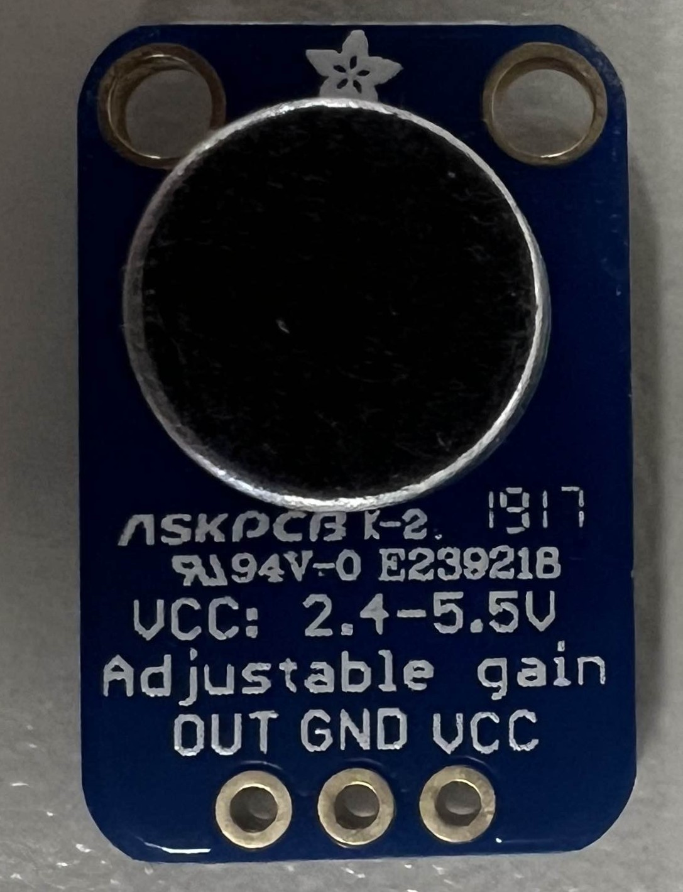

# MAX_4466

Analog read based sensor that returns the volume present

## connections

The sensor has a clearly labled pinout.

| pin | discription |
|-----|-------------|
| out | output of the sensor|
| gnd | gnd |
| vcc | vcc (2.4 - 5.5 v) |

## usage

In order to get a readvalue from the sensor, all that has to be done is to read the analog value from the output pin.

When using the arduino IDE, this can be achieved using AnalogRead().

## [code example](./MAX_4466.ino)
