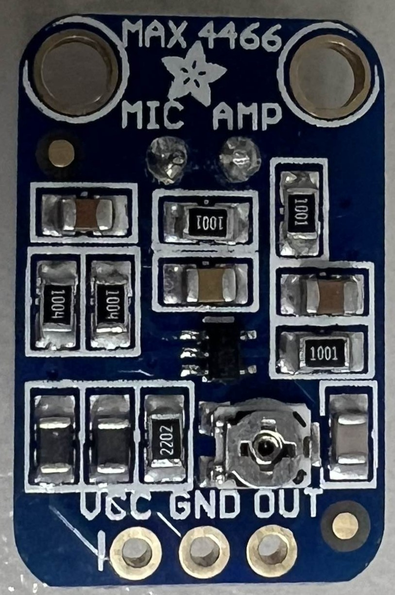

# Homestation with Yellow Screen

The goal of the project is to have a sort of homescreen / homestation for multiple sensors. These sensors consist mainly of air quality, temperature, light level and volume meter / sensors. All the available should then be displayed on the homescreen.

## Components and sensors

Below is a quick and brief discussion about all the components and sensors used within the project. There are also links to certain sites of these components aswell to the demo code for all the components of this project.

---
### TP4056 Mini USB

[Link](https://www.compomax.com.br/en/produto/modulo-carregador-bateria-litio-tp4056)

---
### als-pt19 ( light sensor )
Easy to use light sensitive resistor based sensor that returns an analog value to represent the light intensity.

   

[Code](<Demo Code/ALS-PT19/ALS-PT19.ino>) | [Link](https://www.adafruit.com/product/2748)

---
### esp8266_wifi ( wifi module )
Esp82 based wifi module to communicate with the loxone server

   

[Code](<Demo Code/ESP8266_WIFI/ESP8266_WIFI.ino>) | [Links](https://components101.com/development-boards/nodemcu-esp8266-pinout-features-and-datasheet)

---
### ky-015_dht11 ( temperature and humidity sensor )
Basic temperature and humidity sensor that can be controlled using certain libraries from adafruit

  

[Code](<Demo Code/KY-015_DHT11/KY-015_DHT11.ino>) | [Links](https://www.az-delivery.de/nl/products/dht-11-temperatursensor-modul) | [extra documentation](./Demo%20Code/KY-015_DHT11/KY-015_DHT11.md)

---
### mh_z19c ( co2 level sensor )
Sensor to read co2 levels via uart communication between the sensor and the main board

   

[Code](<Demo Code/MH_Z19C/MH_Z19C.ino>) | [Links](https://www.tinytronics.nl/nl/sensoren/lucht/gas/winsen-mh-z19c-co2-sensor-met-kabel)

---
### max_446 ( volume meter )
Analog read based sensor that returns the volume present

   

[Code](<Demo Code/MAX_4466/MAX_4466.ino>) | [Links](https://www.distrelec.be/en/max4466-microphone-amplifier-5v-adafruit-1063/p/30091129) | [extra documentation](./Demo%20Code/MAX_4466/MAX_4466.md)

---
### NANO 33 BLE SENSE
Arduino nano used to communicate between all sensors the internet module and the homescreen

   

[Links](https://docs.arduino.cc/hardware/nano-33-ble-sense/)

---
### scd30 ( general air sensor )
Sensor module for c02 levels, temperature and humidity

   

[Code](<Demo Code/SCD30/SCD30.ino>) | [Links](https://sensirion.com/products/catalog/SCD30)

---
### stm-5 ( general air sensor )
Sensor module for multiple air condition related values, uses i2c communication

    

[Code](<Demo Code/STM-5/STM-5.ino>) | [extra documentation](./Demo%20Code/STM-5/STM-5.md)

---
### ppd42 ( air quality sensor)
Sensor to detect polution within the air, pulse triggered interrupt sensor

   

[Code](<Demo Code/PPD42/PPD42.ino>) | [extra documentation](./Demo%20Code/PPD42/ppd42.md)

---
### esp32-2432s028 ( yellow display )
Esp32 with a build in tft display. main display of the project

   

[Code](<Demo Code/yellowscreen/homescreen/homescreen.ino>) | [Links](https://randomnerdtutorials.com/esp32-cheap-yellow-display-cyd-pinout-esp32-2432s028r/#:~:text=The%20ESP32%20Cheap%20Yellow%20Display%20(ESP32%2D2432S028R)%20is%20a,interfaces%20for%20your%20IoT%20projects.)

## main circuit

Above is a general discription how the electronics are all connected together where black are the main components and red the sensors. Blue and green are the dedicated communication lines between the sensors and components

In the current design the wifi module and the arduino nano have been replaced by a esp8266.
 - [ky-015_dht11](./Demo%20Code/KY-015_DHT11/KY-015_DHT11.md)
 - [max_4466](./Demo%20Code/MAX_4466/MAX_4466.md)
 - [ppd42](./Demo%20Code/PPD42/ppd42.md)
 - [stm-5](./Demo%20Code/STM-5/STM-5.md)
 - [mh_z19c](./Demo%20Code/MH_Z19C/mh_z19c.md)

here are also the link's towards the documentation about the main home screen and node module:
 - [node](./Full%20Code/Node/node.md)
 - [homescreen](./Full%20Code/Yellow/homescreen.md)

## conclusie

Ondanks dat het project uiteindelijk minder sensoren bevat dan we intensioneel voorzien hadden. Is het tot een degelijk resultaat gekomen, de sensor data wordt van alle sensoren goed uitgelezen en doorgestuurd naar de loxone server, vervolgens kan het homescreen de data opvragen en bijgevolg op het scherm afbeelden.

Er waren enkele problemen met het uitlezen van de sensoren over uart, aangezien de standard uart van de esp82 wordt gebruikt voor serial communication met de pc. Maar ondanks deze kleine tegenslag hebben we alles aan de praat gekregen.

