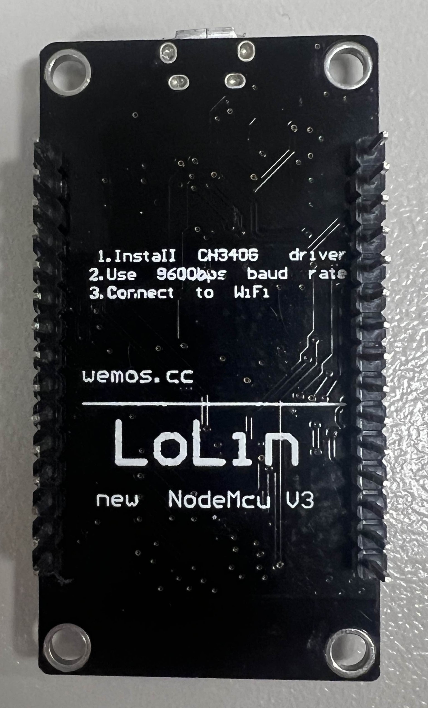

# Homestation with Yellow Screen

## Components  

### TP4056 Mini USB
  

Description :

[Link](https://www.compomax.com.br/en/produto/modulo-carregador-bateria-litio-tp4056)

### ALS-PT19
   

Description :

[Code](<Demo Code/ALS-PT19/ALS-PT19.ino>)

[Link](https://www.adafruit.com/product/2748)

### NodeMCU ESP8266MOD  
   

Description :

[Links](https://components101.com/development-boards/nodemcu-esp8266-pinout-features-and-datasheet)

### KY-015 DHT11
  

Description :

[Code](<Demo Code/KY-015_DHT11/KY-015_DHT11.ino>)

[Links](https://www.az-delivery.de/nl/products/dht-11-temperatursensor-modul)

### MH-Z19C  
   

Description :

[Code](<Demo Code/KY-015_DHT11/MH-Z19C.ino>) 

[Links](https://www.tinytronics.nl/nl/sensoren/lucht/gas/winsen-mh-z19c-co2-sensor-met-kabel)

### MAX4466 Microphone  
   

Description :

[Code](<Demo Code/MAX_4466/MAX_4466.ino>)

[Links](https://www.distrelec.be/en/max4466-microphone-amplifier-5v-adafruit-1063/p/30091129)

### NANO 33 BLE SENSE  
   

Description :

[Links](https://docs.arduino.cc/hardware/nano-33-ble-sense/)

### SCD30 Sensor  
   

Description :

[Links](https://sensirion.com/products/catalog/SCD30)

### STM-5  
    

Description :

[No Link]()

### PPD42 sensor
   

Description :

[Code](<Demo Code/PPD42/PPD42.ino>)

[Links]()

### ESP32-2432S028 (Yellow Screen)  
   

Description :

[Links](https://randomnerdtutorials.com/esp32-cheap-yellow-display-cyd-pinout-esp32-2432s028r/#:~:text=The%20ESP32%20Cheap%20Yellow%20Display%20(ESP32%2D2432S028R)%20is%20a,interfaces%20for%20your%20IoT%20projects.)

